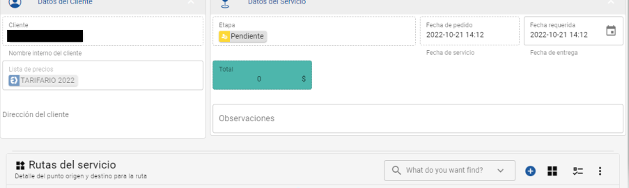

# Asistente Virtual WhatsApp

## **Clientes No frecuentes (Esporádicos)**

En el caso de este tipo de clientes, al comunicarse a través de la línea de WhatsApp de Valija, el robot actuará de la siguiente manera:

1. &#x20;El cliente al escribir a la línea de WhatsApp de Valija,  el robot le responderá y colocará el nombre que esa persona tenga configurado en su WhatsApp.
2. El robot esperará 3 segundos y le mostrará el Menú de Servicios, donde el usuario puede seleccionar: Cotizar/Contratar o Estado de servicio.

<figure><figcaption></figcaption></figure>

3\. Si pincha Cotizar/Contratar, el robot lo guiará para que defina las direcciones de Retiro y Entrega.         &#x20;

<figure><figcaption></figcaption></figure>

4\. Primero el robot preguntará dónde se realiza el retiro y le pedirá validar al cliente si la dirección que se definió es la correcta.

<figure><figcaption></figcaption></figure>

<figure><figcaption></figcaption></figure>

5\. Si la dirección definida no es la correcta, el cliente deberá seleccionar No y el robot le pedirá nuevamente que ingrese la dirección, esto se repetirá la cantidad de veces necesarias hasta que el cliente se aseguré que la dirección es la correcta.

6\. Si la dirección de retiro definida es la correcta, el cliente selecciona Si, el robot le pedirá dónde se realizará la entrega y le pedirá validar al cliente si la dirección que se definió es la correcta.

<figure><figcaption></figcaption></figure>

<figure><figcaption></figcaption></figure>

7.- Si la dirección definida no es la correcta, se repite lo definido en el paso 5.

8.- Si la dirección de entrega definida es la correcta, el cliente selecciona Si, y el robot indicará que se les ha notificado a las agentes de servicio, las cuales validarán los datos y con ello enviar el presupuesto.

<figure><figcaption></figcaption></figure>

<figure><figcaption></figcaption></figure>

9.- La agente podrá observar el servicio solicitado ingresando al módulo de Servicios, en la vista EN REVISION

<figure><figcaption></figcaption></figure>

<figure><figcaption></figcaption></figure>

10.- Si la agente aprueba el servicio, cambia el estado del mismo a En Aprobación. Ahora visualizará el servicio en la vista EN APROBACION.

<figure><figcaption></figcaption></figure>

11.- Al agente realizar el paso anterior, el robot envía la cotización al cliente, con los datos para realizar la transferencia y le pregunta si desea contratar el servicio.

<figure><figcaption></figcaption></figure>

<figure><figcaption></figcaption></figure>

12.- Si el cliente selecciona No, el robot informa que el servicio fue anulado y vuelve a mostrar el menú de servicios.

&#x20;                                                     

&#x20;                                                          .png>)

13.- Si la respuesta es afirmativa, le llegará un mensaje y el cliente deberá ingresar otros datos, colocando “na” si lo que se está solicitando no aplica.

<figure><figcaption></figcaption></figure>

### ¿Qué sucede si el cliente contrata el servicio?

14.- El robot le preguntará al cliente el punto de retiro, nombre y teléfono de contacto, y algún comentario adicional que desee agregar.

15.- Luego el robot le preguntará al cliente el punto de entrega, departamento/oficina/bodega, contacto y teléfono para la entrega, y algún comentario adicional que desee agregar.

16.- Entregada esa información, el robot envía un mensaje al cliente, donde indica que el servicio ha quedado programado y le pregunta si desea enviar el comprobante de pago.

&#x20;                                                 .png>)

17.- Al cliente enviar el comprobante de pago, la agente le indica que se procederá a dar inicio al servicio.

18.- El cliente puede consultar, en cualquier momento, el estado de su (s) servicio (s), le mostrará los que están Pendientes y en Ruta. También le preguntará si desea anular algún servicio.

&#x20;                                                          

&#x20;                                                        .png>)

19.- Si desea anular algún servicio, podrá anular los que están Pendientes, los que están en Ruta ya no se pueden anular a través del robot de WhatsApp.

&#x20;                                                      .png>)

20.- Al escribir nuevamente, el robot le saludará, le mostrará el menú y deberá seleccionar Estado de servicio.

&#x20;                                                      .png>)

21.- El robot le enviará al cliente un mensaje al momento de que el servicio esté completado.

&#x20;                                                 .png>)


#### Si no hay respuesta por parte del cliente, pasado 5 minutos, el robot enviará un mensaje indicando que, por seguridad, cerrará la sesión.


&#x20;                                                    .png>)

## **Clientes Frecuentes**

Estos clientes son los que se han convertido en Partner Account. Al comunicarse a través de la línea de WhatsApp de Valija, el robot actuará de la siguiente manera:

1. El cliente al escribir a la línea de WhatsApp de Valija, el robot le responderá y colocará el nombre que esa persona tenga configurado en su WhatsApp.
2. El robot esperará 3 segundos y le mostrará el Menú de Servicios, donde el usuario puede seleccionar: Cotizar/Contratar o Estado de servicio.

&#x20;                                         .png>)

&#x20;  3\. Si pincha Cotizar/Contratar, el robot le indicará que está creando el servicio.

&#x20;                                      .png>)

&#x20; 4\. El robot le indicará que se ha creado el servicio y que proceda a asignar las rutas.

&#x20;                                    .png>)

&#x20; 5\. En la pantalla del usuario aparecerá un mensaje donde se le muestra el enlace de       una página a la que se va a dirigir, debe presionar CONTINUAR y el robot lo redirigirá a la página de EURUS para que pueda loguearse al sistema.

&#x20;                                       .png>)

&#x20;   6\. Allí ingresará su usuario y contraseña para poder ingresar al sistema.

&#x20;                                         .png>)

&#x20;     7\. Al loguearse, el sistema automáticamente le creará un servicio, sin rutas. Tendrá una ruta en blanco donde podrá ingresar la dirección de origen y de destino.

&#x20;    8\. Al realizar el paso anterior, la agente de Valija, dará inicio al Servicio.

&#x20;    9\. El robot enviará un mensaje en el momento de que el servicio sea completado.

&#x20;   10\. El cliente podrá consultar el estado de su servicio en cualquier momento.


**Nota 1: La sala de chat queda abierta para que la agente de Valija pueda conversar con el cliente. Así que la agente de Valija es la que cierra la sala manualmente.**



**Nota 2: El cliente Partner Account, al loguearse al sistema podrá generar un servicio. Ingresando al módulo de Servicios, pincha en el botón de agregar** .png>)**y se le genera el Servicio. Realizado este paso podrá asignar la Ruta.**


****

&#x20;    &#x20;

&#x20;                                                   ****                                                   &#x20;

